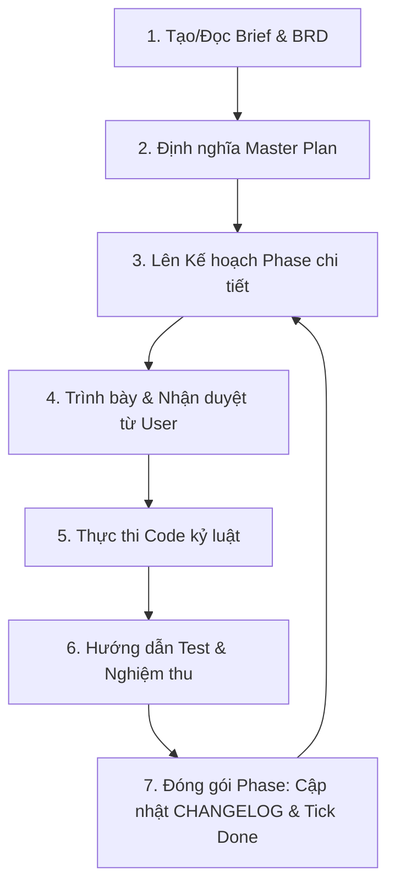

# Solo Builder Starter Kit 🛠️

Bộ công cụ (Starter Kit) đóng gói quy trình **Solo Builder** tiêu chuẩn, giúp bạn dễ dàng thiết lập và chuyển giao quy trình làm việc cực kỳ kỷ luật này sang bất kỳ dự án mới nào.

Quy trình **Solo Builder** được thiết kế để định hình hành vi của AI Agent (ví dụ: Antigravity, Claude, GPT-4) hoạt động như một **Senior Fullstack Developer kiêm Project Manager** chuyên nghiệp, loại bỏ hoàn toàn các lỗi thường gặp như:
- Nhảy phase hoặc code lộn xộn không có kế hoạch.
- "Mất trí nhớ" hoặc tự ý sửa đổi code phá vỡ cấu trúc hiện tại.
- Quên cập nhật tài liệu trạng thái (CHANGELOG, Git commits, Master Plan).

---

## 📁 Cấu Trúc Gói Đóng Gói (Kit Structure)

Thư mục `solo-builder-kit` bao gồm:
```text
solo-builder-kit/
├── templates/
│   ├── AGENTS.md                  # Quy tắc và luật chơi nghiêm ngặt cho AI Agent
│   ├── CHANGELOG.md               # File ghi nhận lịch sử thay đổi (Changelog) mẫu
│   └── docs/
│       ├── brief.md               # Tài liệu mô tả nhanh dự án mẫu
│       ├── BRD.md                 # Tài liệu Yêu cầu Nghiệp vụ mẫu
│       └── plans/
│           ├── master-plan.md     # Kế hoạch phát triển tổng thể theo Phase mẫu
│           └── phase-template.md  # Kế hoạch chi tiết cho từng Phase phát triển mẫu
│   └── skills/
│       └── solo-builder-executor/
│           └── SKILL.md           # Kỹ năng định hướng chu trình khép kín của Agent
├── setup.cjs                      # CLI script tự động khởi tạo cấu trúc cho dự án mới
├── hdsd-solo-builder.html         # Sổ tay Hướng dẫn Sử dụng tương tác (Premium UI/UX)
└── README.md                      # Hướng dẫn này
```

---

## 🚀 Hướng Dẫn Cài Đặt (Installation)

### Bước 1: Sao chép thư mục kit
Sao chép toàn bộ thư mục `solo-builder-kit` vào thư mục gốc của dự án mới của bạn.

### Bước 2: Chạy script tự động thiết lập
Mở terminal tại thư mục gốc của dự án mới của bạn và thực thi lệnh sau:

```bash
node solo-builder-kit/setup.cjs
```

### Bước 3: Điền thông tin dự án tương tác
Script CLI sẽ hiển thị giao diện tương tác để bạn nhập:
1. **Tên dự án** (Mặc định lấy tên của thư mục hiện tại).
2. **Tech Stack** của dự án (Các công nghệ chính bạn dự kiến sử dụng để định hướng cho AI Agent).

Sau khi hoàn tất, script sẽ tự động tạo ra cấu trúc thư mục, sao chép các template và điền chính xác tên dự án cùng Tech Stack của bạn vào file `AGENTS.md` và các tài liệu liên quan.

---

## 🔄 Vòng Lặp Làm Việc Cốt Lõi (Solo Builder Workflow)

Sau khi cài đặt thành công, quy trình hoạt động giữa bạn và AI Agent sẽ tuân theo vòng lặp 7 bước khép kín:



1. **Lên Plan Chi Tiết (`Plan`):** Trước khi bắt tay vào code bất kỳ phase nào, AI Agent phải tạo một file kế hoạch chi tiết (ví dụ: `docs/plans/phase-1.md`) mô tả checklist công việc, Expected Outcomes và Testing Strategy.
2. **Duyệt Kế Hoạch (`Review`):** AI Agent trình bày kế hoạch cho bạn và đợi bạn phê duyệt.
3. **Thực Thi Code (`Execute`):** AI Agent tiến hành viết code dựa trên checklist, tuân thủ đúng Tech Stack quy định trong `AGENTS.md`.
4. **Nghiệm Thu (`Test`):** AI Agent đưa ra hướng dẫn cụ thể (manual test steps) để bạn chạy thử nghiệm tính năng hoặc viết test script.
5. **Cập Nhật Trạng Thái (`State Management`):** 
   - Cập nhật file `CHANGELOG.md` ghi nhận sự thay đổi.
   - Check tick `[x]` cho phase tương ứng trong `docs/plans/master-plan.md`.
   - Đề xuất hoặc thực hiện Git commit và Git push để bảo đảm an toàn mã nguồn.

---

## 🌟 Ưu Điểm Vượt Trội Của Solo Builder

- **Tính Kỷ Luật Tuyệt Đối:** Giúp các AI Agent thế hệ mới (như Antigravity) hoạt động trong một khuôn khổ an toàn, hiệu quả và có tổ chức.
- **Tiết Kiệm Token:** Bằng cách tập trung vào Phase hiện tại, AI Agent không phải đọc toàn bộ code của các phase khác một cách dư thừa, tiết kiệm chi phí vận hành AI.
- **Dễ Dàng Bàn Giao:** Mọi dự án sử dụng Solo Builder đều có cấu trúc tài liệu đồng bộ, giúp bất kỳ lập trình viên nào khi tiếp nhận dự án cũng có thể hiểu ngay tiến độ và cách thức hoạt động chỉ trong 5 phút.
